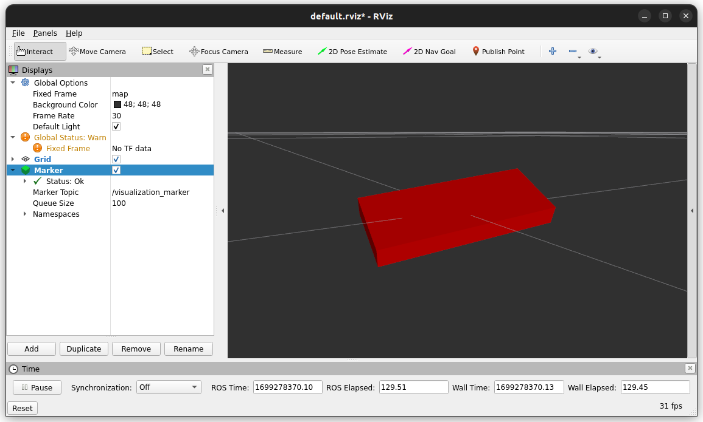

# Wireless IMU
Read from IMU, do sensor fusion, and send quaternion (wxyz) and rotational velocity (rx, ry, rz in rad/s) data over serial and BLE.
written for Arduino nano 33 BLE board
requires some custom libraries- check setup steps

## setup
1. install Arduino IDE
2. install these libraries with Arduino IDE's library manager:
    - [Arduino_LSM9DS1](https://github.com/arduino-libraries/Arduino_LSM9DS1)
    - [SensorFusion](https://github.com/aster94/SensorFusion)
    - 
3. manually install the *feat.write_buf* branch of SRL's fork of HardwareBLESerial, which implements the `write_buf()` function : https://github.com/srl-ethz/Arduino-HardwareBLESerial/tree/feat.write_buf (download / git clone the repository into your ~/Arduino/libraries/ directory)

## usage
sample programs use ROS and publish the orientation data to the *visualization_marker* topic- you can use rviz to visualize it as a red box

## sensor calibration (optional)
if you want really accurate measurements, calibrate the sensor using FemmeVerbeek's fork of Arduino_LSM9DS1 https://github.com/FemmeVerbeek/Arduino_LSM9DS1
[video tutorial](https://www.youtube.com/watch?v=BLvYFXoP33o)